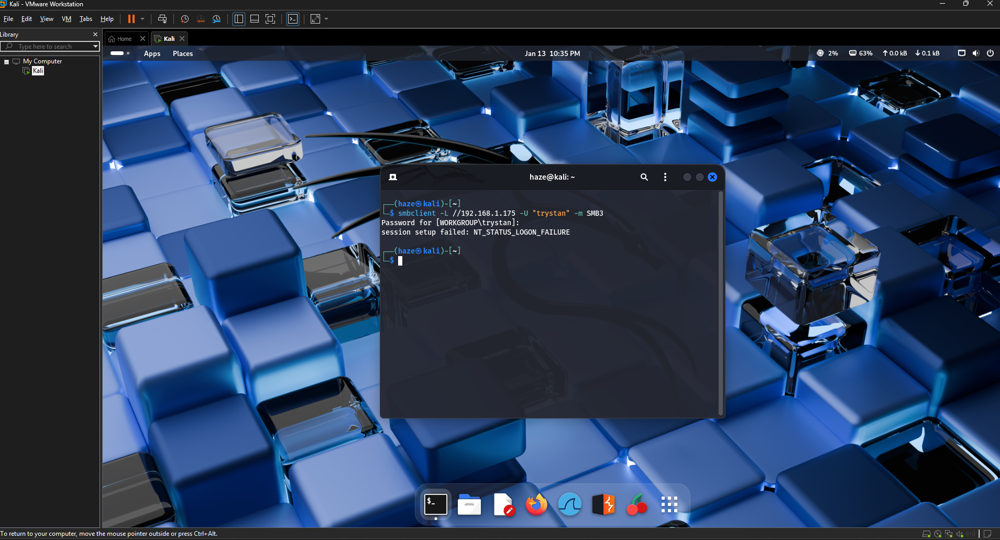
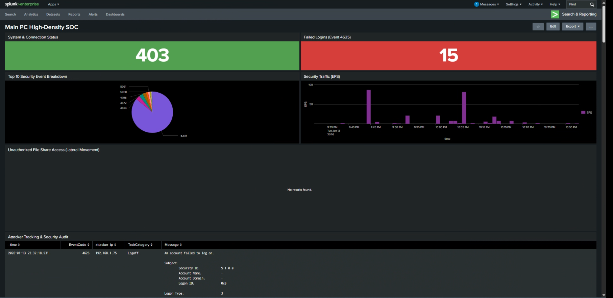
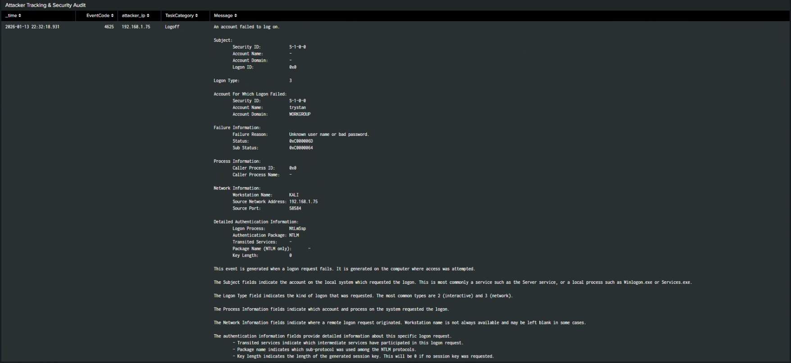

# Splunk SIEM Lab #01 — Brute Force Attack Detection & Remediation

---

## Overview

Ran a brute force simulation on my home lab — Kali as the attacker, Windows host as the target.

---

## Attack

---

## Detection

Splunk flagged it through the Failed Logons panel. 15 Event ID 4625 entries in a short window.

Drilled into the events — all 15 came from `192.168.1.75`, workstation name "Kali."

| Field | Value |
|---|---|
| Source IP | 192.168.1.75 |
| Workstation Name | Kali |
| Event ID | 4625 (Failed Logon) |
| Attempt Count | 15 |

---

## IOC Summary

| IOC Type | Value | Confidence |
|---|---|---|
| Attacker IP | 192.168.1.75 | High |
| Attacker Workstation | Kali | High |
| Event Signature | 15x Event ID 4625 | High |

---

## MITRE ATT&CK

| Technique ID | Technique Name | Notes |
|---|---|---|
| T1110 | Brute Force | 15 failed logon attempts from single IP |
| T1078 | Valid Accounts | Targeting existing accounts |
| T1021 | Remote Services | Remote connection attempt to Windows host |

---

## Remediation

- Blocked `192.168.1.75` on the host firewall
- Set account lockout policy to trigger after 5 failed attempts
- Reset the targeted account's password

---

*Write-up by Trystan Ruiz*
